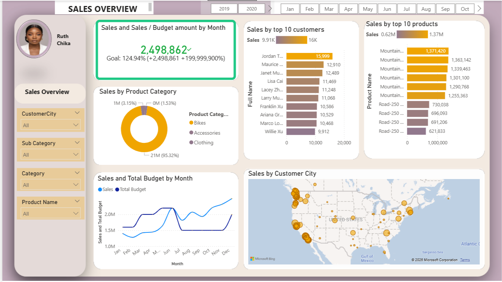
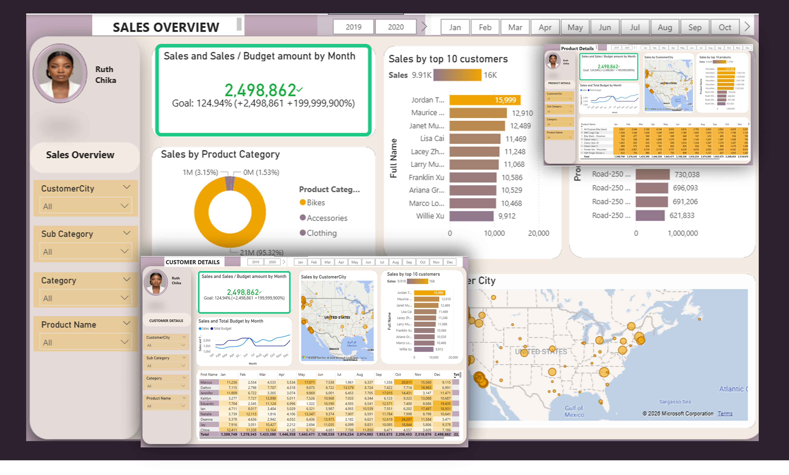
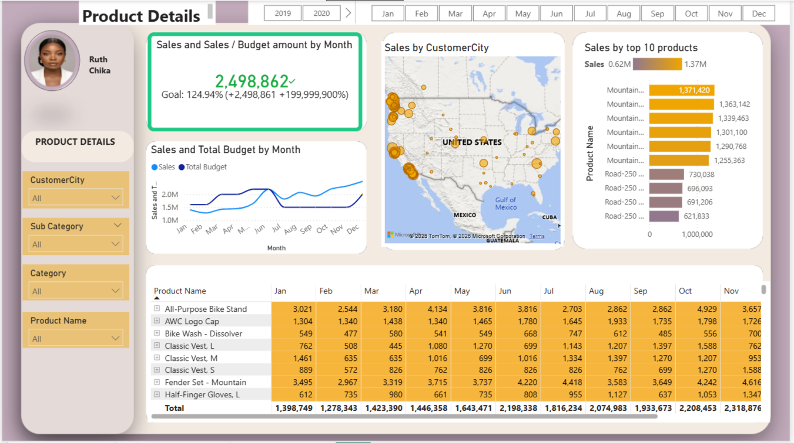

# Sales Analysis Dashboard | SQL Server & Power BI

## Business Request
The Sales Manager requested a move from static reports to 
interactive visual dashboards to better track internet sales 
performance  focusing on products sold, customers, and 
performance against budget over time.

## User Stories

| No | Role | Request | Value | Acceptance Criteria |
|----|------|---------|-------|-------------------|
| 1 | Sales Manager | Dashboard overview of internet sales | Follow which customers and products sell best | Power BI dashboard updated daily |
| 2 | Sales Representative | Detailed overview of internet sales per customer | Follow up customers that buy the most | Dashboard with customer filters |
| 3 | Sales Representative | Detailed overview of internet sales per product | Follow up products that sell the most | Dashboard with product filters |
| 4 | Sales Manager | Sales overview against budget | Follow sales over time against budget | Dashboard with KPI and graphs |

## Tools Used
- SQL Server Express
- SQL Server Management Studio (SSMS)
- Power BI Desktop
- Microsoft Excel (Budget Data)

## Data Source
- AdventureWorksDW2019 Database
- Budget data provided in Excel for 2021
- Analysis covers 2 years back in time

## What I Built

### SQL — Data Extraction & Cleaning
Extracted and cleansed the following tables from 
AdventureWorksDW2019:
- DIM_Customers
- DIM_Products
- DIM_Date
- FACT_InternetSales
- FACT_Budget (Excel)

## Key Business Questions Answered
- Which customers generate the most sales?
- Which products perform best?
- How does actual sales compare to budget?
- Which cities have the highest sales concentration?
- How has sales trended over time by month?

## Files in This Repository
| File | Description |
|------|-------------|
| DIM_Customers.sql | Cleansed customer data with geography join |
| DIM_Products.sql | Cleansed product data |
| FACT_InternetSales.sql | Core sales fact table |
| DIM_Date.sql | Date dimension table |
| budget_2021.xlsx | Budget data provided by business |
| screenshots/ | Dashboard screenshots |

## Acknowledgement
Guided project by Ali Ahmad
